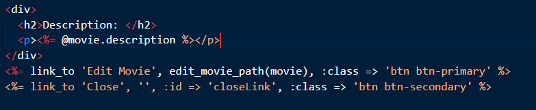
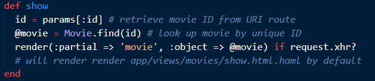
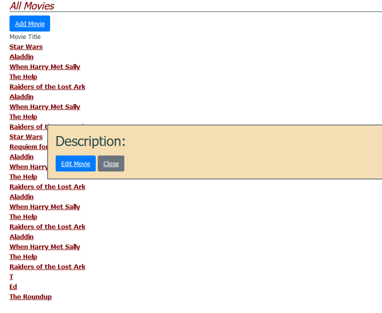
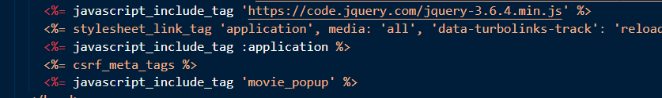

# Ajax

Previamente necesitamos realizar las migraciones y bundle install para que se pueda ejecutar el proyecto. Ya que da un error en la tabla movigoers

```
$ rails db:migrate
```
### Parte 1

**Creamos el partial**



**Pregunta**
¿Cómo sabe la acción de controlador si show fue llamada desde código JavaScript o mediante una petición HTTP normal iniciada por el usuario? Utiliza el código siguiente para mostrar la acción del controlador que renderizará la vista parcial.

-Mediante request.xhr? podemos saber si es una solicitud AJAX o no y así renderizar lo que necesitemos

**Modificamos la acción del controlador**
Esto nos permitirá renderizar el partial si la solicitud es una XMLHttpRequest 




### Parte 2

¿Cómo debería construir y lanzar la petición XHR el código JavaScript? Queremos que la ventana flotante aparezca cuando pinchamos en el enlace que tiene el nombre de la película.
```
var MoviePopup = {
  setup: function() {
    // add hidden 'div' to end of page to display popup:
    let popupDiv = $('<div id="movieInfo"></div>');
    popupDiv.hide().appendTo($('body'));
    $(document).on('click', '#movies a', MoviePopup.getMovieInfo);
  }
  ,getMovieInfo: function() {
    $.ajax({type: 'GET',
            url: $(this).attr('href'),
            timeout: 5000,
            success: MoviePopup.showMovieInfo,
            error: function(xhrObj, textStatus, exception) { alert('Error!'); }
            // 'success' and 'error' functions will be passed 3 args
           });
    return(false);
  }
  ,showMovieInfo: function(data, requestStatus, xhrObject) {
    // center a floater 1/2 as wide and 1/4 as tall as screen
    let oneFourth = Math.ceil($(window).width() / 4);
    $('#movieInfo').
      css({'left': oneFourth,  'width': 2*oneFourth, 'top': 250}).
      html(data).
      show();
    // make the Close link in the hidden element work
    $('#closeLink').click(MoviePopup.hideMovieInfo);
    return(false);  // prevent default link action
  }
  ,hideMovieInfo: function() {
    $('#movieInfo').hide();
    return(false);
  }
};
$(MoviePopup.setup);
```
**Explicación**
El código se divide principalmente en 4 funciones:funcionesa:
```
-setup: Esta función se encarga de configurar el entorno para el manejo de las ventanas emergentes. Crea un nuevo elemento div con el ID 'movieInfo', lo oculta y lo añade al final del cuerpo del documento. Luego, establece un escuchador de eventos en el documento que reacciona a los clics en enlaces (a) dentro de elementos con el ID 'movies'. Cuando se hace clic, invoca la función getMovieInfo.
```
```
-getMovieInfo: Esta función realiza una solicitud AJAX ($.ajax) a la URL especificada por el enlace que fue clicado. La URL se obtiene utilizando $(this).attr('href'). Si la solicitud es exitosa, invoca la función showMovieInfo para mostrar la información de la película en la ventana emergente. Si hay un error en la solicitud AJAX, se muestra una alerta y se previene el comportamiento predeterminado del enlace.
```
```
-showMovieInfo: Esta función se encarga de mostrar la información de la película en la ventana emergente. Calcula la posición y el tamaño del div para centrarlo en la pantalla y lo muestra. También establece un escuchador de eventos para el clic en el enlace con id 'closeLink', que invocará la función hideMovieInfo cuando se haga clic.
```
```
-hideMovieInfo: Esta función simplemente oculta el div con id 'movieInfo' cuando se llama, y también previene el comportamiento predeterminado del enlace.
```

Finalmente, este código se encarga de llamar a la función setup cuando el documento está listo para asegurar que las configuraciones iniciales se realicen correctamente.

**Se Agregan los estilos**




**Observaciones**
Es importante realizar algunos ajustes extras en el código para que las ventanas emergentes funcionen correctamente.


Tenemos que cargar el jquery que se encuentra disponible por defecto en ruby on rails pero tenemos que precargarlo en la página.
Además de incluir el javascript de movie_popup.js

### Parte 3

El problema está al crear elementos dinamicamente mediante myClass ya que al usar $(.myClass).on(click,func) y luego de la primera carga de la página los elementos creados no tendrá el manejador al evento click.
Podemos solucionarlo se selecciona un antecesor común, como el documento o un elemento padre específico, y se asigna el manejador de eventos al evento de ese padre.

```
$(document).on('click', '.myClass', function() {
  // Código del manejador de eventos
});
```
Aquí una aplicación para el código de nuestro proyecto

```
$(document).on('click', '#movies a', MoviePopup.getMovieInfo);
```

ya que #movies a es el padre de todos los elementos que tienen el id movies, se asigna el manejador de eventos al evento de ese padre.
